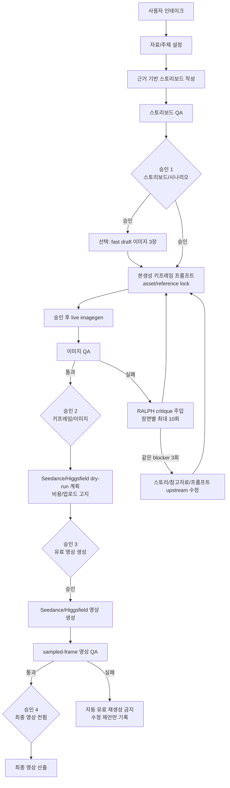

# 현재 안전영상 생성 알고리즘 원페이저

## 한 줄 요약

이 하네스는 안전영상 주제나 교육자료를 받아서 `스토리보드 -> 이미지 키프레임 -> Seedance/Higgsfield 영상 -> 최종 QA` 순서로 만드는 승인 게이트형 파이프라인이다. 기본 원칙은 dry-run first이며, live 이미지 생성, 외부 업로드, 유료 영상 생성은 승인 전 실행하지 않는다.

## 전체 흐름

```text
인테이크
  -> 자료/주제 설정
  -> 근거가 있는 스토리보드 작성
  -> 스토리보드 QA
  -> 승인 1: 스토리보드/시나리오
  -> 선택: 빠른 이미지 초안
  -> 본생성 키프레임 프롬프트 + asset/reference lock
  -> 승인 후 live imagegen
  -> 이미지 QA + RALPH 수정 루프
  -> 승인 2: 키프레임/이미지
  -> Seedance/Higgsfield dry-run 계획 + 비용/업로드 고지
  -> 승인 3: 유료 영상 생성
  -> sampled-frame 영상 QA
  -> 승인 4: 최종 영상 컨펌
```

## 알고리즘 그림



## 알고리즘 설명

1. 먼저 주제, 길이, 화면비, 이미지 밀도, 참고자료, 스타일, 텍스트 전달 방식을 받는다.
2. 자료가 있으면 source facts를 뽑고, 자료가 없으면 사용자가 준 주제 범위 안에서 스토리를 만든다.
3. 스토리보드는 장면별 원인과 결과가 이어지는 하나의 흐름으로 만든다.
4. 스토리보드 QA가 통과해도 바로 이미지를 만들지 않는다. 사용자의 스토리보드 승인을 별도로 받는다.
5. 빠른 방향 확인이 필요하면 `--fast-draft`로 대표 장면 3장만 먼저 준비한다.
6. 본생성 전에는 인물, PPE, 장비, 공간, 스타일을 asset lock/reference layer로 고정한다.
7. 이미지 생성 후에는 장면 일치, PPE, 장비, 배경, 위험구역, 인물 일관성을 QA한다.
8. 이미지가 부족하면 RALPH 루프가 실패 이유를 다음 프롬프트에 넣고 재생성한다. 통과하면 즉시 멈추며, 장면당 최대 10회다. 이번 안전모 프로젝트는 점수가 낮지 않아 1회 QA에서 통과했다.
9. 승인된 시작/끝 keyframe만 Seedance/Higgsfield 영상 생성에 사용한다. prompt-only 영상 생성은 production으로 보지 않는다.
10. 유료 영상 생성 전에는 예상 credits와 외부 업로드 허용 여부를 다시 확인한다.
11. 영상은 메타데이터만 보지 않고 sampled frames/contact sheet로 시선, 행동, 교육 명확성, 장면 연결을 검사한다.
12. 최종 영상도 QA 이후 사용자 컨펌을 따로 받아야 완료로 본다.

## 이번 안전모 프로젝트 실행 기준

이번 프로젝트에서 RALPH가 여러 번 돈 것은 아니다. 이미지 QA 결과가 기준을 넘었고 blocker가 없어서 `1회` 검증 후 통과했다.

```text
image_qa_loop.passed = true
image_qa_loop.iteration = 1
ralph_loop.status = passed
blockers = 0
next_action = approve_or_manual_review
```

따라서 `최대 10회`는 실패했을 때만 적용되는 상한이다. 통과하면 2회차로 가지 않고 즉시 멈춘다.

## 승인 게이트

| 단계 | 필요한 승인 | 승인 후 가능한 일 |
|---|---|---|
| 1 | 스토리보드/시나리오 승인 | live 이미지 생성 가능 |
| 2 | 키프레임/이미지 승인 | Seedance/Higgsfield 업로드와 영상 단계 진행 가능 |
| 3 | 유료 영상 생성 승인 | 유료 Seedance/Higgsfield 실행 가능 |
| 4 | 최종 영상 컨펌 | 결과물을 최종본으로 표시 가능 |

승인은 서로 대체되지 않는다. 스토리보드에 대한 "진행해"는 이미지 승인, 유료 생성 승인, 최종 컨펌이 아니다.

## 내가 먼저 묻는 질문

새 안전영상 프로젝트를 시작하면 아래를 짧게 확인한다.

1. 영상 주제는 무엇인가? 예: 안전모 착용, 지게차 사각지대, 협착 예방.
2. 대상자는 누구인가? 예: 신규입사자, 현장 작업자, 관리자.
3. 영상 길이는 몇 초인가?
4. 이미지 밀도는 어느 정도인가? 예: 빠른 초안, 보통, 촘촘하게.
5. 참고할 교육자료, SOP, PPT, PDF, 사진이 있는가?
6. 참고 이미지는 어떤 폴더 성격인가? 예: 사람, PPE, 장비, 공간, 스타일.
7. 어떤 스타일 가이드를 쓸 것인가? 없으면 기존 `references/style/catalog.json`에서 후보를 보여준다.
8. 화면비는 무엇인가? 예: 16:9, 9:16, 1:1.
9. 영상 안 텍스트가 필요한가? 필요하면 이미지 안 글자가 아니라 자막/오버레이로 처리한다.
10. 외부 업로드와 유료 Seedance/Higgsfield 생성을 나중에 승인할 수 있는가?

승인 질문은 별도로 4번 한다: 스토리보드 승인, 이미지 승인, 유료 영상 생성 승인, 최종 영상 컨펌.

## 빠른 초안 경로

`generate_images.py --fast-draft`는 초기 화면 방향만 빨리 확인하는 경로다. 보통 첫 장면, 중간 장면, 마지막 장면처럼 대표 장면 3개만 imagegen 작업으로 준비한다. 사용자가 방향을 받아들이기 전까지 production급 asset lock과 RALPH 반복 검증은 일부러 건너뛴다.

이 경로는 취향과 방향 확인용이며, 최종 키프레임으로 보지 않는다.

## 본생성 이미지 경로

본생성 이미지는 아래 조건을 요구한다.

- 승인된 스토리보드
- 참고자료와 스타일 결정
- 반복 등장 인물, PPE, 장비, 공간, 스타일에 대한 asset lock
- 이전 장면, 현재 행동, 다음 장면 연결을 포함한 연속성 프롬프트
- 수동 QA JSON, contact sheet 같은 시각 검증 evidence

승인된 이미지는 덮어쓰지 않는다. 새 시도는 새 버전으로 남긴다.

## RALPH 루프

RALPH는 early-stopping 수정 루프다.

- 통과하면 즉시 멈춘다.
- 실패한 이미지는 blocker별 critique를 다음 프롬프트에 주입한다.
- 같은 blocker가 3회 반복되면 무작정 재생성하지 않고 스토리보드, 참고자료, 프롬프트 쪽으로 에스컬레이션한다.
- 이미지 루프는 장면당 최대 10회다.
- 유료 영상은 RALPH로 자동 재생성하지 않는다.

## 영상 생성 경로

Seedance/Higgsfield는 승인된 start/end keyframe과 reference media를 사용한다. 10초 영상은 보통 5초 클립 2개를 만든 뒤 이어 붙이는 구조다. 생성된 영상은 sampled frames로 검사하고, 자막이나 오버레이는 이미지 안에 생성하지 않고 후처리 산출물로 붙인다.

## 주요 산출물

| 영역 | 파일 |
|---|---|
| Story | `story/scenes.json`, `story/image_prompts.json`, `story/video_prompts.json` |
| Gates | `qa/approvals.json` |
| Images | `media/images/draft/`, `media/images/approved/` |
| QA | `qa/storyboard_quality_reviews.json`, `qa/image_qa_loop.json`, `qa/image_manual_reviews.json`, `qa/video_qa_*.json` |
| Evidence | contact sheets, sampled frames, `llm-wiki/evaluation-rounds.md` |
| Output | `media/video/clips/`, `media/output/` |

## 프로젝트 폴더 구조

```text
projects/<slug>/
├── AGENTS.md                         # 프로젝트별 작업 규칙
├── HANDOFF.md                        # 다음 세션 인수인계
├── PLAN.md                           # 작업 계획
├── project_config.json               # 주제, 길이, 화면비 등 설정
├── input/
│   ├── sources.json                   # 등록된 원본 자료 목록
│   ├── source_facts.json              # 자료에서 뽑은 안전 근거
│   ├── extracted_topics.json          # 후보 주제
│   └── sources/
│       ├── raw/                       # 원본 PPT/PDF/이미지
│       └── rendered/                  # 렌더링된 자료
├── refs/
│   ├── people/ ppe/ equipment/        # 후보 참고자료
│   ├── approved/                      # 승인 참고자료
│   │   ├── people/ spaces/ style/
│   │   ├── camera/ lighting/ work/
│   └── asset-lock/                    # 본생성 기준 고정 레이어
├── story/
│   ├── scenes.json                    # 스토리보드 원본 계약
│   ├── image_prompts.json             # 이미지 프롬프트
│   ├── imagegen_jobs.json             # imagegen 작업 목록
│   ├── video_prompts.json             # Seedance/Higgsfield 프롬프트
│   └── versions/                      # 스토리 버전 기록
├── media/
│   ├── images/
│   │   ├── draft/ approved/ rejected/
│   ├── video/
│   │   ├── clips/ inspection/ sampled_frames/
│   ├── subtitles/
│   ├── audio/
│   └── output/                        # 최종 mp4 등 결과물
├── qa/
│   ├── approvals.json                 # 단계별 승인 상태
│   ├── storyboard_quality_reviews.json
│   ├── image_qa_loop.json
│   ├── image_manual_reviews.json
│   ├── video_qa_*.json
│   ├── evidence/                      # contact sheet 등 증거
│   └── evaluation_rounds.jsonl        # QA round ledger
└── llm-wiki/
    └── evaluation-rounds.md           # 사람이 읽는 QA 요약
```

## 왜 이렇게 구성했나

가장 비싸고 되돌리기 어려운 단계는 유료 영상 생성이다. 그래서 알고리즘은 불확실성을 앞단의 저비용 단계, 즉 기획, 빠른 이미지 초안, 이미지 QA, 명시 승인으로 밀어낸다. 영상 생성이 시작되면 텍스트 프롬프트나 메타데이터만 믿지 않고, 승인된 키프레임과 sampled-frame QA로 판단한다.
